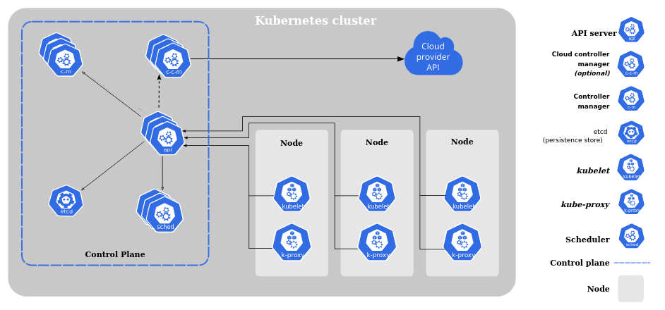

# Class 6

### EBS

Elastic Beanstalk is a service provided by AWS that is used for deploying and scaling web applications and services.

### Kubernetes

Kubernetes was developed by google based on their internal container-oriented cluster management system named **Borg**. The word Kubernetes comes from a greek word which means Orchestrator. It's a platform for managing containers. It provides a control plane that is used to monitor and manage the states of all containers running in a system.

#### What it can do -

- **Load balance** - It works as a load balancer.
- **Storage orchetration** - It allows the user to use a storage of their choice.
- **Automatic rollback / rollouts** - It automates the creation, update and deletion of containers.
- **Automatic bin packing** - It fits containers to the allocated nodes in a way that makes the best use of available resources.
- **Self healing** - It can restart failed containers on its own and even replace them.
- **Secret and configuration management** - It can deploy and update configuration secrets without rebuilding container image.

#### Components

The Kubernetes cluster consists of 2 main components. They are -

- **Control Plane** - It controls the worker nodes inside a Kubernetes system. Control planes consist of odd number of nodes. The components inside a control plane are -

  - **kube-apiserver** - This server exposes the Kubernetes API and is used to manipulate the state of objects in Kubernetes. Every other component in the Kubernetes cluster communicates with each other through this server. It runs on **443** port.
  - **etcd** - This is like a caching system where all data related to nodes are stored. Here the data is stored in key-value pairs.
  - **kube-scheduler** - It takes data from **etcd**, checks which nodes have space and compatibility to launch new Pods and lets the kube-apiserver know. It only works as a decision maker.
  - **kube-controller-manager** - Here, all the controller processes of the control plane are compiled into a single binary and run as a single process.
  - **cloud-controller-manager** - If Kubernetes is being run on a cloud system, then this manager only runs controller processes that are specific to thay cloud provider.

- **Data Plane** - Data plane is where all the containers are running. Each data plane have several nodes running which are **Virtual Machines**. Each VM contains several **Pods** and each Pod consists of several **Containers**. Here each node has a **docker-engine** along with these following components -

  - **kubelet** - kubelet checks the health of each container in a pod at regular time interval and sends a report to the **kube-apiserver**. The kube-apiserver then stores this data in **etcd**.
  - **kube-proxy** - It's a network proxy that runs on each node.
  - **Container runtime** - It's a software for running containers. Example: Docker.
  - **Pod** - Pods are a collection of containers. Each VM can have several pods.
  - **Container** - Containers are where independent applications or services run.

- **Addons** - Since Kubernetes is not a platform as a service system, it lets the user use addons for some services. One mandatory addon for a Kubernetes cluster is the **cluster DNS** that works as a DNS server.

- **kubectl** - It's a command line tool for Kubernetes for giving commands to the control plane.

