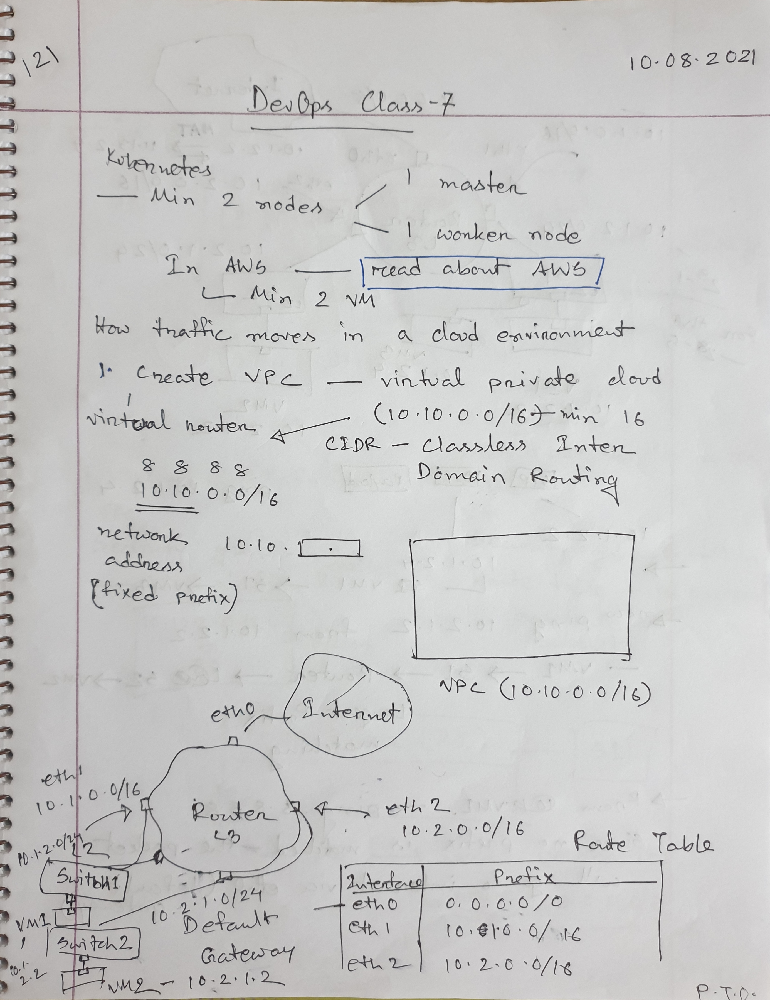
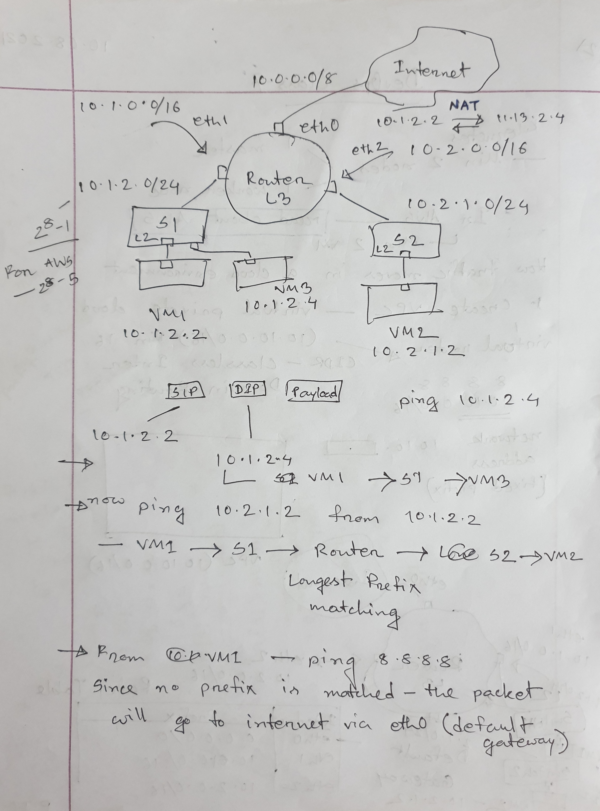
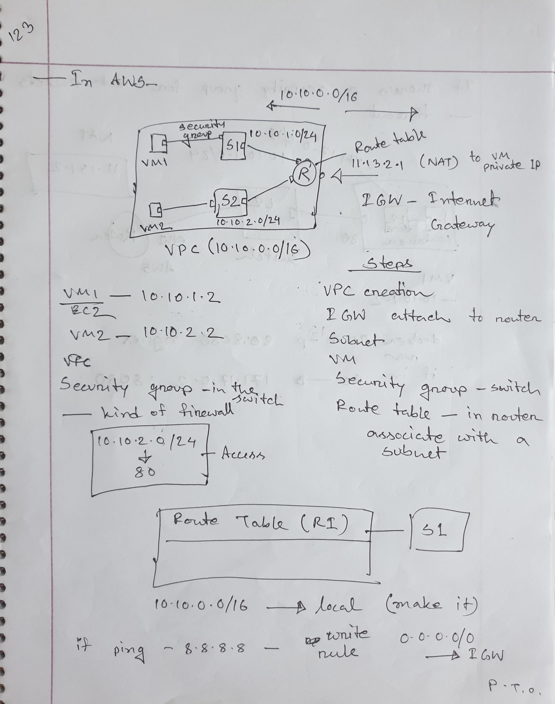
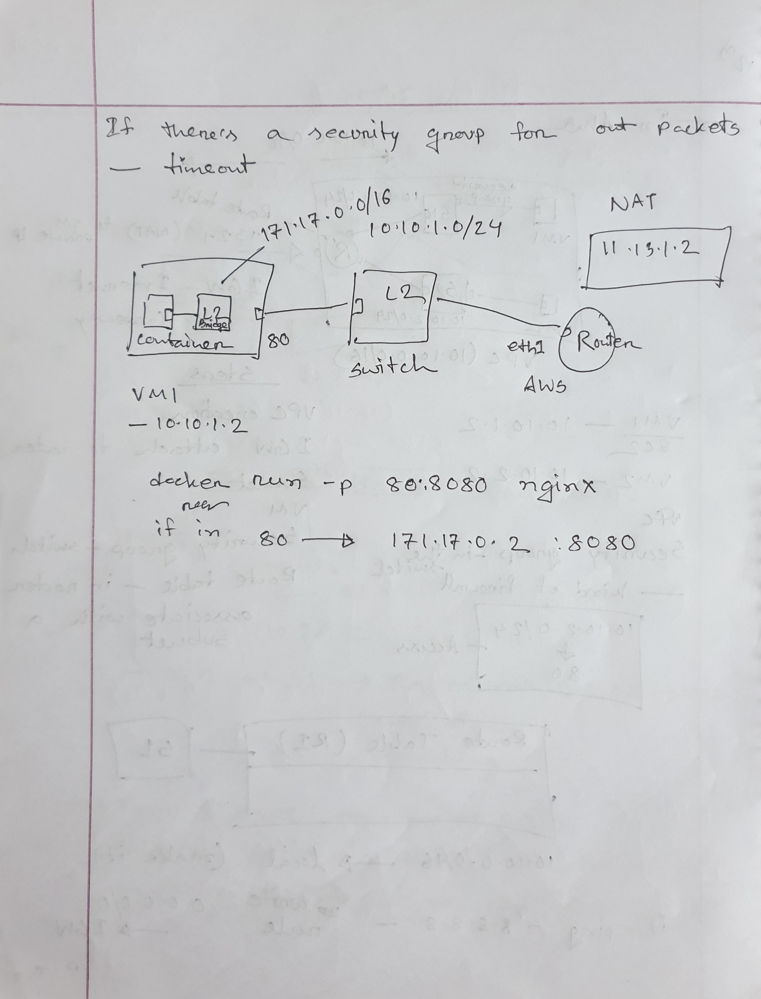

# Class 7

### EC2

Amazon Elastic Compute Cloud is a web service that works like a Virtual Machine in the cloud. The virtual computing environment that it provides is known as an **Instance**.

### VPC

Virtual Private Cloud is a virtual network in ones AWS account. It has its own network range where EC2 instances can be launched. A VPC can have multiple subnets.

### Subnet

Subnet is a range of IP addresses inside a VPC. The range of a subnet must be a subset of the range of the VPC. In a subnet, the first 4 and the last IP address is reserved for the following reasons -

- 1st one is the network address.
- 2nd one is reserved for the VPC router.
- 3rd one is reserved for the DNS server.
- 4th one is reserved for future use.
- Since VPC doesn't allow broadcast, the last IP address is reserved as it is the network broadcast address.

This is why the number of IP addresses we can use in a VPC subnet is always **The number of total available IP adresses - 5**.

### Route table

A route table contains a set of routes to direct the flow of traffic inside a VPC. There's a default main route table, but each subnet can also have its own route table. The route table directs traffic to each route using the Longest Prefix Match algorithm.

### Internet Gateway(IGW)

An internet gateway is the component that allows communication between a VPC and the internet. The outgoing request IPs are translated here using NAT and sent to the internet.

### Security groups

A security group is where we can access control the routes that access EC2 instances in a subnet. One subnet can have multiple security groups.

### Elastic IP Address

It is a reserved public IP address associated to an AWS account that can be assgined to any EC2 instance in a particular region.

### Steps to launch EC2 in a VPC

1. We have to create a VPC. Upon creation, the VPC sets up a Router with a network range.
2. We need to attach the Router to an Internet Gateway.
3. We can create subnets using the network range the VPC provides.
4. We can launch EC2 instances in these subnets.
5. We can define which routes can access which EC2 in the Security group for a subnet.
6. We can associate each subnet with Route Table.

### Class lectures

