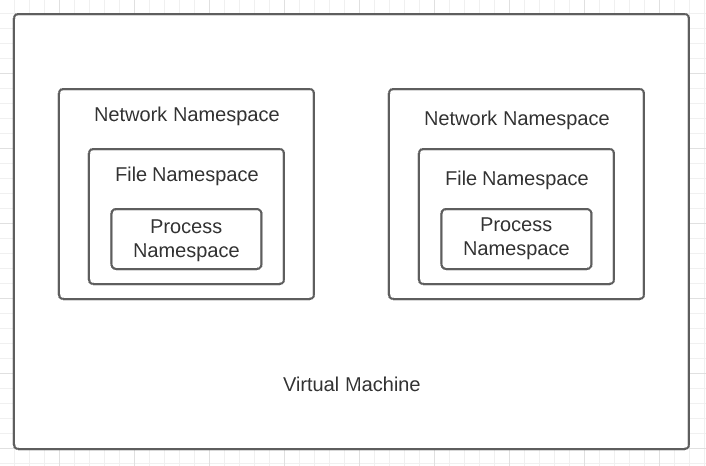

# Class 8

## Steps to launch an Instance in an AWS VPC

1. Select Launch Instances
2. Select the type of Instance you want to create
3. Select the VPC where you want to launch the Instance
4. Select the subnet under the VPC
5. Enable auto assign public IP
6. Select storage
7. Add a Name tag to the Instance
8. Create a security group
9. Select a source for IP
10. Select review and launch
11. Create a key-pair and download it
12. Launch the Instance

## Namespaces

Namespaces are a feature of Linux that helps to segregate resources such as -

- Process namespace
- File namespace
- Network namespace



## Steps to create network namespaces and connect them

1. Change the key_pair files access permission and establish a connection with the Instance.

   ```
   $ cd key_pair_folder
   $ sudo chmod 400 key_pair_filename
   $ ssh -i key_pair_filename ubuntu@public_IP_of_Instance
   ```

   We can see the route table and mac address table of the Instance with these commands.

   ```
   $ route
   $ arp -a
   ```

2. To create a network namespace -

   ```
   $ sudo ip netns add namespace1
   $ sudo ip netns add namespace2
   ```

   We can check if the namespace has been added in this way -

   ```
   $ sudo ip netns list
   ```

3. To enter a network namespace -

   ```
   $ sudo ip netns exec namespace1 sh
   ```

   To check its interface -

   ```
   $ ip link
   ```

4. **veth device** - virtual ethernet devices create a bridge between network namespaces. At this step we'll create a veth device to connect two namespaces.

   ```
   $ sudo ip link add veth-namespace1 type veth peer name veth-namespace2
   ```

5. To insert the interfaces of the device to a namespace -

   ```
   $ sudo ip link set veth-namespace1 netns namespace1
   $ sudo ip link set veth-namespace1 netns namespace2
   ```

6. To add IP address to the veth interfaces -

   ```
   $ sudo ip netns exec namespace1 sh
   $ ip addr add IP_address dev veth-namespace1
   ```

7. To bring the veth device interface up -

   ```
   $ ip link set dev veth-namespace1 up
   ```
